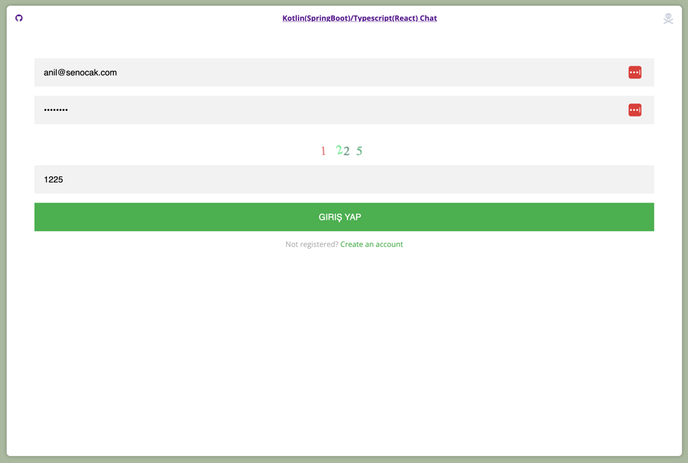
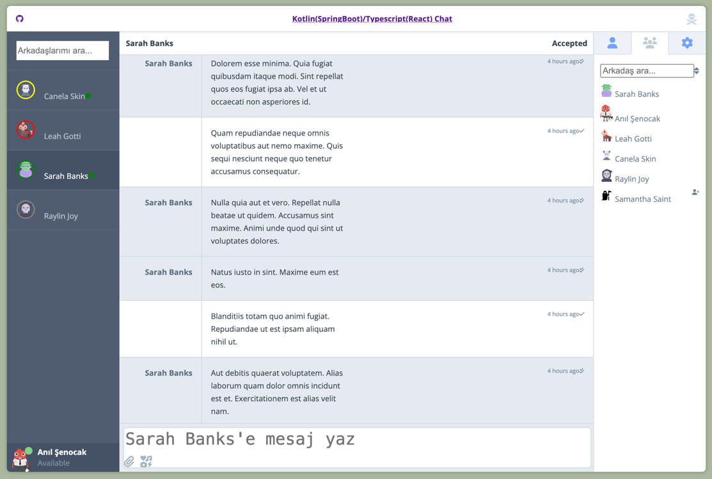
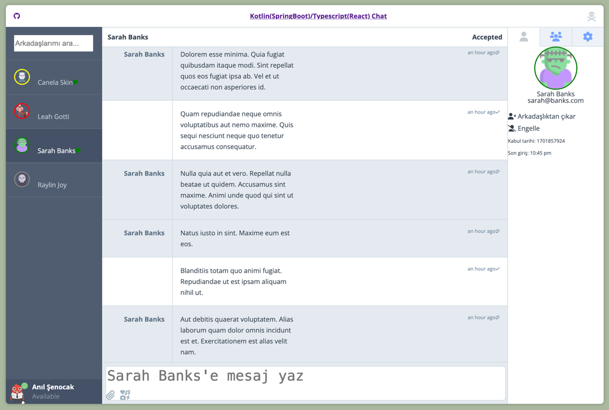

# Private Chat Application Kotlin(SpringBoot)/Typescript(React)

<samp>
    
    
    
    <br>
    
    

</samp>

<br/>





## Installation

```bash
git clone https://github.com/senocak/Kotlin-React-Chat.git
```

```bash
cd Kotlin-React-Chat/react-ts
npm install && npm run start
```

```bash
cd Kotlin-React-Chat/spring-kotlin
mvn clean install
```

# Any pr's welcomed